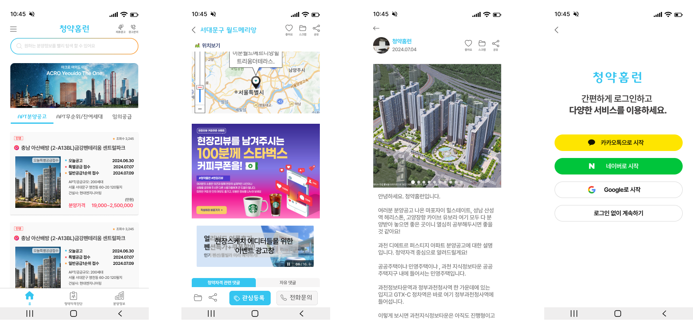

# 청약홈런(Server)

> 2024.01. - 현재
>
> 팀프로젝트(기획자1 , 디자이너1, 개발자1)

## 🛠 Skills

- Flutter, Dart
- Node.js , TypeScript
- Firebase

## **🏠서비스 내용**

**주택 청약**에 대한 커뮤니티 모바일 애플리케이션 입니다.

현재 제공하려는 핵심 기능은 다음과 같습니다.

1. **분양공고** : 한국 부동산원에서 제공하는 분양 공고 API를 이용하여 분양 공고를 제공하고, 현장리뷰, 댓글, 대댓글, 좋아요, 스크랩 등의 커뮤니티 기능을 제공
2. **현장리뷰** : 분양 단지의 사진을 찍어 리뷰를 하고 서로 댓글과 좋아요 등을 통해 커뮤니케이션
3. **청약자격진단** : 사용자가 자신의 상황을 입력하여 현재 자격을 진단

## 💻 주요 개발 내용

- 클라이언트
  - 분양공고 페이지
  - 현장리뷰 작성, 수정, 삭제, 댓글, 대댓글, 좋아요, 싫어요, 북마크 등의 커뮤니티 기능 구현
  - 댓글, 공고, 공지사항등의 리스트 데이터 무한 스크롤 구현
  - 소셜로그인
  - 글 작성시 이미지 삽입 및 수정 시 데이터베이스에 업로드된 이미지를 불러와서 이어서 수정하는 기능
  - 글 임시저장
  - 네이버 맵 연동 등
  - 서버 및 데이터베이스와 연동된 위젯들의 비동기 처리 및 예외처리
  - Shorebird를 이용한 코드푸쉬
- 서버(Firebase Functions)
  - 소셜로그인 및 회원가입
  - 커스텀 HTTP 객체
  - 한국부동산원 청약홈 API와 연동하여 매일 공고 업데이트
  - 글 작성, 수정, 좋아요, 조회수 증가

## 🛠️ 트러블 슈팅

### 클라이언트

- [**Firebase Storaget 캐싱**](https://www.notion.so/b5c4711192014994a699981d216eadb4?pvs=4#e2712802f0eb4f1c93b41c986fbecda6)
- [**Firestore Snapshot 페이지네이션**](https://www.notion.so/b5c4711192014994a699981d216eadb4?pvs=4#e503cd914ee6444c8c70945a0cfac53b)
- [**Getx를 이용한 상태관리**](https://www.notion.so/b5c4711192014994a699981d216eadb4?pvs=4#93fa4f0e686847319f19acc850ef9baf)

### 서버

- [**API응답 처리 미들웨어**](https://www.notion.so/b5c4711192014994a699981d216eadb4?pvs=4#f8602a597f7e4f858f4404d8709f3f8f)
- [**Promise.all을 사용한 성능 향상**](https://www.notion.so/b5c4711192014994a699981d216eadb4?pvs=4#42c3c42930a84e43a7ef6cf7e2131ba3)
- [**소셜로그인**](https://www.notion.so/b5c4711192014994a699981d216eadb4?pvs=4#d937181293a047d99c110c4a987eaa23)
- [**트랜잭션을 이용한 동시성 제어**](https://www.notion.so/b5c4711192014994a699981d216eadb4?pvs=4#fc032b69e8fe4ed88e3d204e77181829)

### 공통

- [**예외처리**](https://www.notion.so/b5c4711192014994a699981d216eadb4?pvs=4#eb4fb8518f0d404d80f95ea81e67299d)

## 깃허브 링크

https://github.com/JioBani/homerun : 클라인언트

https://github.com/JioBani/homrun-functions : 서버